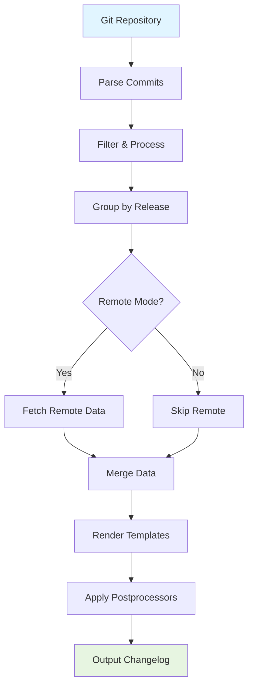

git-cliff is built as a Cargo workspace consisting of two main components: a core library (`git-cliff-core`) and a CLI binary (`git-cliff`). This modular design allows the changelog generation logic to be reused as a library while providing a powerful command-line interface.

## Project Structure

The project follows a workspace architecture:

```
git-cliff/
├── git-cliff-core/     # Core library
│   ├── src/
│   └── Cargo.toml
├── git-cliff/          # CLI binary
│   ├── src/
│   └── Cargo.toml
└── Cargo.toml          # Workspace manifest
```

### Workspace Dependencies

Shared dependencies are managed at the workspace level in the root `Cargo.toml`:

- **regex**: Pattern matching for commit parsing
- **glob**: File pattern matching
- **log**: Logging infrastructure
- **secrecy**: Secure handling of sensitive data (API tokens)
- **reqwest**: HTTP client for remote integrations
- **dirs**: Platform-specific directory paths
- **url**: URL parsing and manipulation

## Core Library (`git-cliff-core`)

The core library provides all the changelog generation functionality. It's designed to be feature-flagged for flexibility:

### Features

- **`repo`** (default): Git repository parsing via `git2`
- **`remote`**: Base for remote integrations
- **`github`**: GitHub API integration
- **`gitlab`**: GitLab API integration
- **`gitea`**: Gitea API integration
- **`bitbucket`**: Bitbucket API integration
- **`azure_devops`**: Azure DevOps API integration

### Key Modules

#### `changelog`

The central module that orchestrates changelog generation:

```rust
pub struct Changelog<'a> {
    pub releases: Vec<Release<'a>>,
    pub config: Config,
    header_template: Option<Template>,
    body_template: Template,
    footer_template: Option<Template>,
    additional_context: HashMap<String, serde_json::Value>,
}
```

Responsibilities:
- Manages releases and their commits
- Handles template rendering
- Coordinates remote data fetching
- Processes commits and generates output

**Location**: `git-cliff-core/src/changelog.rs`

#### `commit`

Represents Git commits with conventional commit parsing:

```rust
pub struct Commit<'a> {
    pub id: String,
    pub message: String,
    pub author: Signature,
    pub committer: Signature,
    // ...
}
```

Responsibilities:
- Parse conventional commits
- Extract commit metadata (author, timestamp, etc.)
- Support custom commit parsers
- Handle commit footers and breaking changes

**Location**: `git-cliff-core/src/commit.rs`

#### `config`

Configuration file parsing and management:

```rust
pub struct Config {
    pub changelog: ChangelogConfig,
    pub git: GitConfig,
    pub remote: RemoteConfig,
    pub bump: Bump,
}
```

Supports:
- TOML and YAML configuration files
- Embedded configurations from `Cargo.toml` or `pyproject.toml`
- Commit parsers and preprocessors
- Link parsers for issue/PR references

**Location**: `git-cliff-core/src/config.rs`

#### `template`

Tera-based templating engine with custom filters:

```rust
pub struct Template {
    name: String,
    tera: Tera,
    pub variables: Vec<String>,
}
```

Custom filters:
- `upper_first`: Capitalize first character
- `split_regex`: Split strings by regex
- `replace_regex`: Replace regex matches
- `find_regex`: Find regex patterns

**Location**: `git-cliff-core/src/template.rs`

#### `release`

Represents a release with associated commits:

```rust
pub struct Release<'a> {
    pub version: Option<String>,
    pub message: Option<String>,
    pub commits: Vec<Commit<'a>>,
    pub commit_id: Option<String>,
    pub timestamp: Option<i64>,
    pub previous: Option<Box<Release<'a>>>,
    pub statistics: Option<Statistics>,
    // Remote metadata for each platform
}
```

Responsibilities:
- Group commits by release
- Track version information
- Calculate statistics
- Store remote metadata (contributors, PRs, etc.)

**Location**: `git-cliff-core/src/release.rs`

#### `remote`

Remote repository integration (GitHub, GitLab, etc.):

```rust
pub trait RemoteClient {
    async fn get_contributors(&self) -> Result<Vec<RemoteContributor>>;
    async fn get_pull_requests(&self) -> Result<Vec<RemotePullRequest>>;
    async fn get_commits(&self) -> Result<Vec<RemoteCommit>>;
}
```

Implementations:
- `github`: GitHub API client
- `gitlab`: GitLab API client
- `gitea`: Gitea API client
- `bitbucket`: Bitbucket API client
- `azure_devops`: Azure DevOps API client

**Location**: `git-cliff-core/src/remote/`

#### Other Modules

- **`repo`**: Git repository operations via `git2`
- **`tag`**: Git tag parsing and handling
- **`contributor`**: Contributor information
- **`statistics`**: Release statistics calculation
- **`summary`**: Commit processing summary
- **`command`**: External command execution
- **`error`**: Error types and handling
- **`embed`**: Embedded file resources

## CLI Binary (`git-cliff`)

The CLI provides the user interface to the core library:

### Structure

- **`main.rs`**: Entry point, argument parsing, changelog generation
- **`args.rs`**: Command-line argument definitions (using `clap`)
- **`lib.rs`**: Core CLI logic, configuration initialization
- **`logger.rs`**: Logging setup
- **`profiler.rs`**: Optional performance profiling
- **`bin/completions.rs`**: Shell completion generation
- **`bin/mangen.rs`**: Man page generation

### Features

- **`default`**: Update informer + all integrations
- **`integrations`**: All remote platform integrations
- **`update-informer`**: Check for new versions
- **`remote`**: Base remote support
- **`github`**, **`gitlab`**, **`gitea`**, **`bitbucket`**, **`azure_devops`**: Platform-specific
- **`profiler`**: Performance profiling support

## Data Flow



### Step-by-Step Process

1. **Repository Access**
   - Open Git repository using `git2`
   - Read configuration from `cliff.toml`, `Cargo.toml`, or `pyproject.toml`

2. **Commit Parsing**
   - Iterate through commit history
   - Parse conventional commits (type, scope, description, breaking changes)
   - Apply custom commit parsers from configuration
   - Extract metadata (author, timestamp, SHA)

3. **Filtering & Processing**
   - Filter commits by patterns (include/exclude)
   - Skip commits based on configuration
   - Parse links (issues, PRs) from commit messages
   - Process commit preprocessors

4. **Release Grouping**
   - Group commits between Git tags
   - Create release objects with version information
   - Calculate statistics (commit count, contributors, etc.)

5. **Remote Data Fetching** (if enabled)
   - Connect to remote platform APIs
   - Fetch contributors, pull requests, and commits
   - Merge remote metadata with local data

6. **Template Rendering**
   - Load header, body, and footer templates
   - Render using Tera template engine
   - Apply custom filters and context variables

7. **Postprocessing**
   - Apply regex-based postprocessors
   - Format and clean output

8. **Output Generation**
   - Write to file or stdout
   - Update existing changelog or create new one

## Configuration System

Configuration can be loaded from multiple sources:

1. **Dedicated config file**: `cliff.toml` (default)
2. **Cargo manifest**: `Cargo.toml` under `[package.metadata.git-cliff]`
3. **Python project**: `pyproject.toml` under `[tool.git-cliff]`
4. **Embedded defaults**: Built-in templates for common formats

The configuration system uses the `config` crate with TOML and YAML support.

## Template Engine

Based on [Tera](https://tera.netlify.app/), the template engine provides:

- **Variables**: Access to releases, commits, version, etc.
- **Filters**: Transform data (uppercase, regex, etc.)
- **Control flow**: Conditionals and loops
- **Custom functions**: git-cliff-specific helpers

Example template:

```jinja2

## {{ release.version }} - {{ release.timestamp | date(format="%Y-%m-%d") }}

- {{ commit.message }}


```

## Error Handling

Errors are managed through a custom `Error` enum using `thiserror`:

```rust
pub enum Error {
    IoError(io::Error),
    GitError(git2::Error),
    ConfigError(config::ConfigError),
    TemplateError(tera::Error),
    // ...
}
```

This provides consistent error reporting throughout the application.

## Testing Strategy

The project uses:

- **Unit tests**: In individual modules
- **Integration tests**: In `tests/` directories
- **Snapshot tests**: Using `expect-test` for output validation
- **CI checks**: Clippy, rustfmt, and test coverage

To update snapshots:

```bash
env UPDATE_EXPECT=1 cargo test
```

## Performance Considerations

- **Lazy parsing**: Commits are parsed on-demand
- **Caching**: Remote API responses are cached using `cacache`
- **Async operations**: Remote fetching uses Tokio for concurrent requests
- **Optional features**: Tree-shaking unused platform integrations
- **Profiling support**: Optional flamegraph generation for performance analysis

## Build Profiles

The workspace defines optimized build profiles:

- **`dev`**: Fast compilation, panic=abort
- **`release`**: Maximum optimization, LTO enabled, stripped binaries
- **`test`**: Optimized for test performance
- **`bench`**: Debug symbols for profiling
